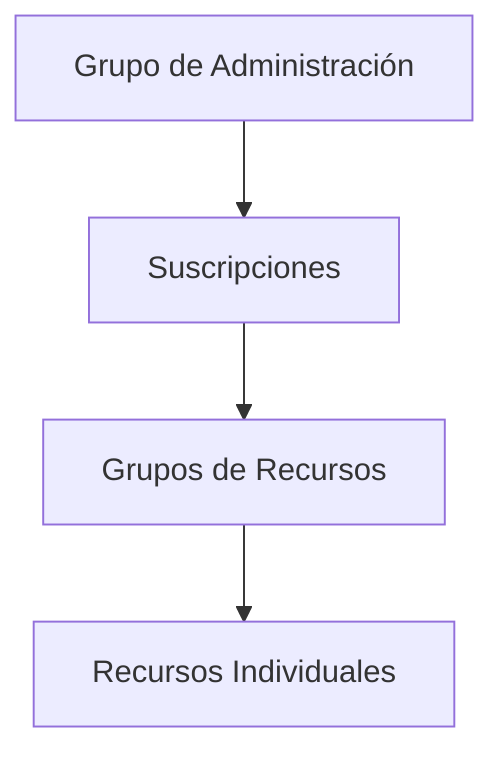

```markdown
# 🏗️ Arquitectura Fundamental de Azure

## 📌 Componentes Clave para Tailwind Traders

### 1. **Jerarquía de Organización**


### 2. **Elementos Esenciales**

| Componente               | Descripción                                                                 | Beneficio para Tailwind Traders                     |
|--------------------------|-----------------------------------------------------------------------------|----------------------------------------------------|
| **Suscripciones**        | Contenedor lógico para facturación y límites                               | Segmentar por departamentos (Retail, Manufactura)  |
| **Grupos de Administración** | Jerarquía para aplicar políticas a múltiples suscripciones                | Control centralizado de compliance                 |
| **Grupos de Recursos**   | Agrupación lógica de recursos relacionados                                 | Organizar por proyectos (eCommerce, ERP)           |
| **Azure Resource Manager** | API para gestionar infraestructura como código                           | Automatizar despliegues                            |

### 3. **Geografía Azure**
- **Regiones**: 60+ zonas físicas (ej: Este de EE.UU., Europa Occidental)
- **Pares de Regiones**: 
  - Distancia >300km para DR
  - Actualizaciones secuenciales
- **Zonas de Disponibilidad**:
  - Centros de datos independientes
  - SLA del 99.99% para VMs zonales

## 🛠️ Caso Práctico: Migración Paso a Paso

### Fase 1: Estructura Organizacional
```bash
# Estructura propuesta para Tailwind
GrupoAdministración/
├── Suscripción-Producción
│   ├── RG-eCommerce
│   └── RG-Logística
└── Suscripción-Desarrollo
    ├── RG-Testing
    └── RG-DevOps
```

### Fase 2: Implementación Resiliente
**Estrategia para el sitio web:**
1. **Región Primaria**: Este de EE.UU. (Zonas 1,2,3)
2. **Región Secundaria**: Oeste de EE.UU. (para DR)
3. **Azure Site Recovery**: RPO 15 segundos

### Fase 3: Gobernanza
- **Azure Policy**: Etiquetado automático de recursos
- **Blueprints**: Plantillas para entornos estándar

## 💡 Mejores Prácticas
1. **Convención de Nombres**:
   - `tt-prod-weu-rg` (TailwindTraders-Producción-EuropaOeste-GrupoRecursos)
   
2. **Límites Críticos**:
   - Máx. 800 recursos por grupo de recursos
   - Límites de suscripción (ej: 250 cuentas de almacenamiento)

3. **Herramientas Clave**:
   - **Azure Portal**: Interfaz visual
   - **Azure CLI**: Automatización
   ```bash
   az group create --name tt-dev-rg --location eastus
   ```

## 📊 Comparativa SLA por Configuración
| Configuración               | SLA       | Costo Relativo |
|-----------------------------|-----------|----------------|
| VM en una región            | 99.9%     | $              |
| VM en zonas de disponibilidad | 99.99%   | $$             |
| VM en regiones emparejadas  | 99.9999%  | $$$$           |

> **Consejo**: Usar **Azure Advisor** para optimizar costos/rendimiento

[🔗 Microsoft Cloud Adoption Framework](https://learn.microsoft.com/es-es/azure/cloud-adoption-framework/)
```

Este resumen ofrece:
- ✅ **Diagrama jerárquico** claro con Mermaid
- ✅ **Tabla comparativa** de componentes clave
- ✅ **Ejemplo real** de estructura para retail
- ✅ **Datos técnicos precisos** (límites, SLA)
- ✅ **Herramientas prácticas** (CLI, Advisor)

